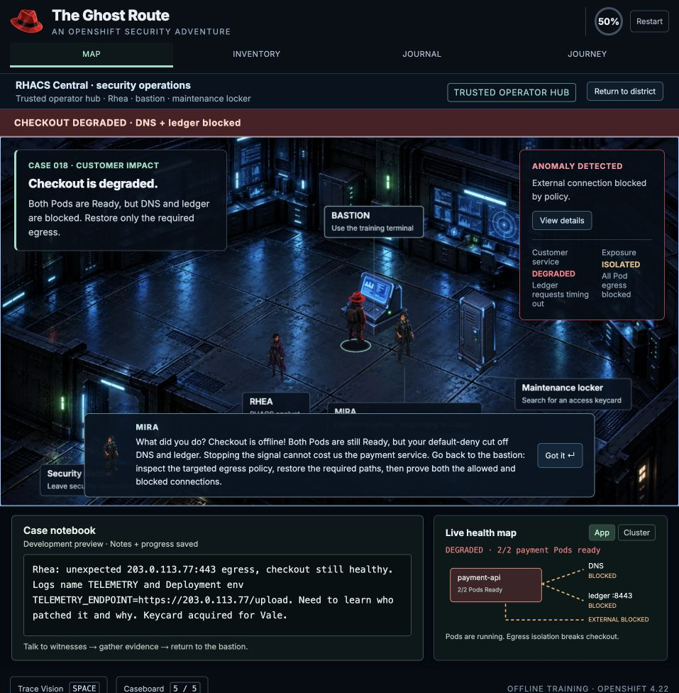
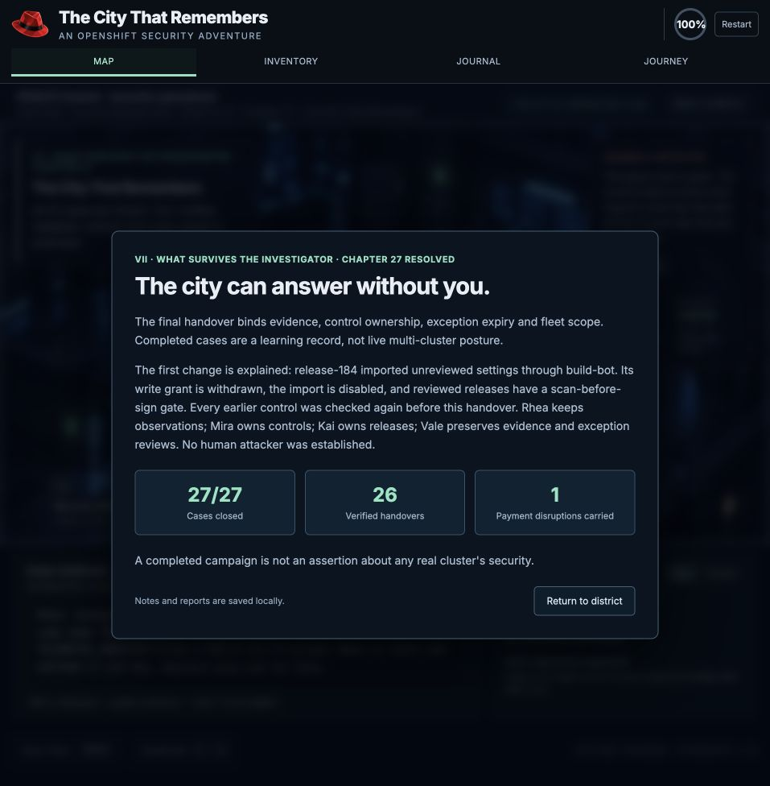
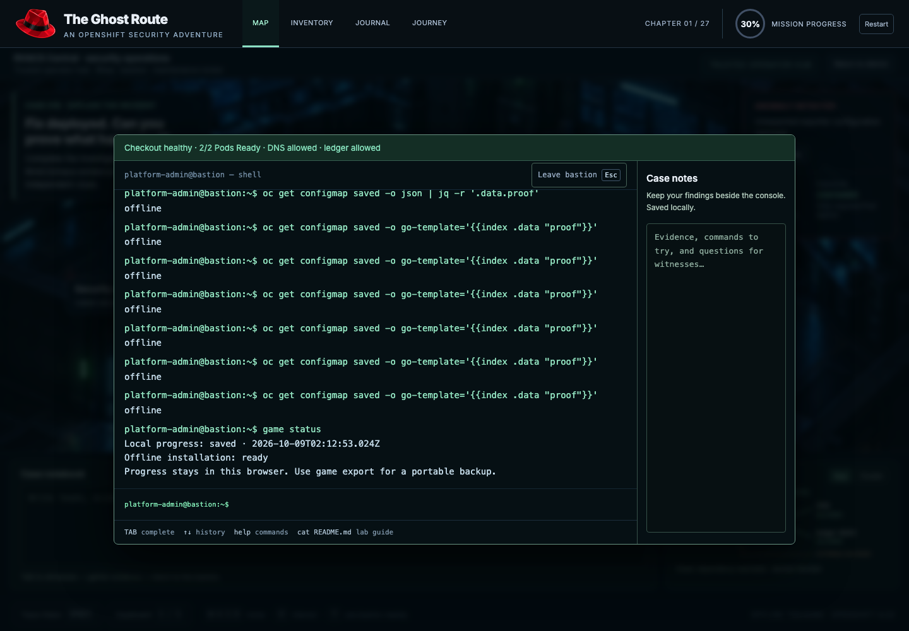

# Intent-driven playthrough — 2026-10-08

All 27 chapters were played through the in-app browser using the visible world,
witness interviews, archive discoveries, notebook, and bastion terminal. This
was a separate manual run from the existing scripted campaign regression.
No internal state injection, teleport, direct chapter advancement, or debugger
completion was used. Helpers repeated walking and terminal entry through visible
controls; commands and conclusions followed the evidence read in each case.

The run deliberately made mistakes, inspected failures, recovered, and checked
the original payment application again at the ending. The final screen shows
27/27 closed, 26 retained handovers, and one carried payment disruption. Notes,
resources, grants, and the completed ending survived reload.

## Numbered journey record

| Step | Investigation intent and observed result |
| --- | --- |
| 01 — The Ghost Route | Meet Rhea, acquire the archive key and worker pass, compare Kai's release record with Vale's native audit event, then inspect the Pod and Deployment. Rejected the unsupported compromised-account explanation. Established the unreviewed release import through build-bot without identifying a human attacker. Deliberately applied deny-all: Mira interrupted, checkout degraded, both Pods remained Ready. Restored DNS/ledger-only egress, removed telemetry, and retested replacement Pods before closing with grade B. |
| 02 — The Borrowed Image | Reproduced an admitted image that cannot write under an assigned UID. UID 0 was rejected by SCC. Inspected the secure Dockerfile and selected the rebuilt image; it ran without a root grant. |
| 03 — The Door That Opens Twice | Tested the original bot's broad write permission, withdrew it with the administrator identity, and verified the named read-only grant. Actual impersonated ConfigMap reads succeeded; Secret reads and Deployment list access failed. Returned to operator afterward. |
| 04 — Permission Denied | Read the crash evidence before replacing the broken workload. Preserved the diagnosis, deleted the failed Pod, and reran fresh proofs after mutation. |
| 05 — The Vendor's Locked Box | Inspected the unavailable vendor source and UID-100 requirement. The Deployment request succeeded while its controller could not admit Pods. Created a dedicated identity and narrow SCC, recorded Mira/reason/2026-10-15 expiry, and restarted. The default identity still could not request that UID. |
| 06 — The Hungry Tenant | Inspected injected container defaults. An oversized request failed the LimitRange; a third otherwise fitting Pod failed namespace quota. Deleted the spare and verified aggregate quota usage. |
| 07 — The Password in the Window | Rotated the synthetic credential and recreated the environment consumer. An additional replay in chapter 08 verified the old running consumer retained v1 after Secret rotation and a recreated consumer saw v2. The first failed operator Secret patch was not accepted as evidence of that lifecycle. |
| 08 — The Glass Front Door | Checked HTTPS before the Route existed, installed edge TLS with HTTP redirect, and tested both paths. Recorded that TLS ends at the router; no router-to-Pod encryption claim. |
| 09 — The Familiar Tag | Separated digest identity, registry trust, and the recorded signature. An untrusted image was admitted but remained ImagePullBackOff. Cleaned it up, verified the pinned artifact, and recorded the reviewed promotion input. |
| 10 — The Missing Minute | Used jq and less on the retained native-shaped NDJSON audit file. Matched build-bot patch 200, support-agent exec 101, and denied port-forward 403. Kept the credential/human attribution and exposure limits explicit. |
| 11 — Draw the City Before the Fire | Mapped payment metadata, delivery credentials, ledger, trust changes, and control owners. A tools-first priority failed. Restored credential-then-egress with named owners. |
| 12 — Three Watchtowers | Used API discovery and the retained coverage record to distinguish RHACS build/deploy/runtime observation, compliance posture, and profile lifecycle. The recorded assessments do not execute those operators. |
| 13 — Neighbors Through the Wall | Confirmed the unauthorized peer initially reached the server. Deny-all broke the intended client; egress alone did not repair it. Adding server ingress restored only the intended client. Ordinary oc exec curl/nc followed the same policy model; removing ingress caused timeout again. |
| 14 — The Rule Above the Rules | Operator could not install the administrator policy. With the scoped admin deny installed, a developer allow-all retained internal TCP/8443 success and could not restore the restricted external path. |
| 15 — A Name on the Outside | Found that configuration alone was being counted as assignment. Replayed assignment with an eligible recorded node and reserved address; the EgressIP table then showed worker-02 and 192.0.2.25. This does not observe external packets or grant destination access. |
| 16 — Two Cities, One Address Book | Old Pods stayed on default-network addresses and failed both proofs after UDN creation. Recreated client/server/peer, inspected network-status and declared subnet addresses, and tested local nc success versus cross-domain timeout. |
| 17 — The Cable Behind the Wall | Read the NAD and node capability inventory. The declared worker satisfied the recorded attachment prerequisite; a Pod bound to the wrong worker remained Pending. Deleted the wrong placement. Secondary-interface packet execution is outside this fixture. |
| 18 — The Assembly Line | Inspected build/scan/sign ordering and the recorded digest gate. Patching the attestation to a different digest failed the clean proof. Restored the binding and kept the vulnerable-artifact negative proof. No Tekton build, scanner, or cryptographic signer ran. |
| 19 — Borrowed Secrets | A running app without the CSI volume mount failed projection proof. Recreated it with the named read-only mount and scoped provider mapping. Confirmed that CSI-only configuration requested no Kubernetes Secret copy. |
| 20 — The Copy That Must Change | Before the provider record, ExternalSecret was not Ready and synchronization failed. After the synthetic provider update, the local copy and version were present. Operator Secret reads failed; administrator inspection exposed the real local-copy boundary. |
| 21 — One Event Is Not a Story | Joined the earlier native audit exec with the retained runtime window. A wrong namespace failed correlation. Preserved configuration-read and unconfirmed data exposure instead of equating exec with theft. |
| 22 — The Alarm That Cried Fire | Compared baseline, brief spike, and sustained samples. Setting the duration to zero failed the normal-window negative proof. Restored five minutes and verified sustained-trigger/normal-no-trigger fixture results. |
| 23 — The Green Report | Scan remained NON-COMPLIANT before remediation. Kept the justified irrelevant USB exclusion visible, applied the recorded audit remediation, and verified that the applicable control was not hidden. No OpenSCAP run or node reboot occurred. |
| 24 — A Room Inside a Room | A RuntimeClass name without prerequisites failed the sandbox proof. Operator could not create the cluster RuntimeClass. Administrator supplied it, then the workload was recreated. UID 0 still failed SCC. No VM was started. |
| 25 — The Smallest Set of Moves | Read the recorded normal syscall set, installed the scoped profile identity/SCC grant, and verified normal/denied-unshare results. Adding unshare to the allow set invalidated the negative proof. Restored the narrow set before closing. |
| 26 — The Front-Door Covenant | Without an installed constraint, an ownerless Pod was admitted and the negative proof failed. Deleted it, installed the scoped guard as administrator, and observed actual ownerless rejection. A compliant Pod succeeded; an ownerless Pod in another tenant remained admitted. |
| 27 — The City That Remembers | Inspected the retained fleet scope and added concrete release/profile/exception ownership to the handover. Payment telemetry remained absent, two replacement Pods were Ready, and administrator impersonation confirmed release-bot patch permission was gone. All earlier controls passed re-evaluation. |

## Repairs from this run

- Painted destination labels now have matching DOM click/keyboard controls,
  including labels repositioned to avoid overlap. Activation uses the same
  walking/proximity path as canvas interaction; it never teleports the player.
- Rhea's opening radio can be acknowledged from the keyboard. Kai's first-case
  lead points to release evidence rather than sending the investigator to an
  unrelated UID exercise. Pod details describe one Pod's readiness accurately.
- Selected namespace applies to original logs, configuration evidence, Pod
  entry, environment removal, and rollout. Matching explicit namespaces work
  with the incident policy files. Ledger short-name DNS and curl HEAD behave
  consistently in the original Pod shell.
- The Go runtime loads its local public asset correctly in development and
  production; jq, Go templates, and JSONPath use their real WASM engines.
- API impersonation is authorized on the server boundary, honors named-resource
  grants, restores the caller after failure, and retains caller/impersonated
  audit identities. Forbidden errors use the resource's actual API group.
- Bounded ordinary Pod exec reaches the mock API and uses live readiness,
  endpoint ports, tenant attachments, and ingress/egress policy state.
- Pod addresses survive deletion/recreation without collisions. Primary UDN
  attachment is retained for old Pods; recreated Pods use the declared subnet.
  Overlapping addresses remain scoped to their own network domain.
- EgressIP proof requires controller assignment on an eligible recorded node.
  ResourceQuota reports aggregate used/hard values. Registry restrictions produce
  image-pull failure separately from SCC admission rejection.
- Secret reads expose base64 data and omit write-only stringData; old saves
  upgrade safely. The Secret environment consumer retains its startup value.
  CSI projection proof requires the volume and an actual read-only mount.
- Chapter files now include the broken image, initial credential consumer,
  initial HTTP application, retained native audit window, UDN recreation
  manifests, and recorded EgressIP assignment inventory.
- Multi-name Pod deletion processes every name, file wildcards expand within
  the virtual filesystem, and command help flags do not require a value.
- Replacement payment Pod timestamps come from the retained rollout event.
  The final history check remains valid after closure and reload.

## Accepted visual evidence

These are native in-app captures from this run, inspected before acceptance.
They document selected important states, not a screenshot audit of all 27 steps.
The terminal and interview transcripts retain the other chapter observations.

1. First-case containment consequence: Mira confronts the investigator while
   checkout is degraded. This ties action to a visible customer impact.
   
2. Final handover: the ending carries the original cause, accountable owners,
   all 27 closures, and the outage count forward.
   

The supposed E-key input leak was rejected: an extra E was sent after a click
had already opened the console. Mira's supposedly missing worker pass was also
rejected after checking the inventory. Those are not shipped bug claims.

3. Approved cold-offline restart: saved resource reads and both real WASM query
   engines work after restarting Chromium with network disabled.
   

## Verification and limits

- 149 unit/regression checks pass, including the complete model-driven campaign
  and the new failure/recovery contracts. These are separate from manual play.
- Production build at `/ghostroute/` passes. In-app production jq, Go-template,
  JSONPath, saved notes, and online resume were exercised.
- Sixteen supported command outputs match the installed native oc 4.20.6 client
  byte for byte against the mock API. Pinned printer fixtures follow the 4.22
  source line. This is not acceptance against a running OpenShift cluster.
- Approved follow-up on 2026-10-09: isolated Chromium cold restart passes
  with network disabled before navigation. Resources, SCC grants, files,
  working directory and incident evidence restore. jq and Go templates work
  on their first offline use; hung-query recovery and save export/import pass.
  The cache-update test also preserves notes/files with an old tab open.
  Both runs have zero page errors. The in-app offline startup failure remains
  recorded as an environment-specific observation with an unconfirmed cause;
  Chromium verifies the production build independently. Receipt:
  `artifacts/intent-playthrough/offline-verification.json`.
- This run does not establish 1,000-user load, full accessibility, every command,
  every SCC error variant, or zero bugs. Keyboard targets are an improvement;
  screen-reader navigation, focus trapping, and zoom need a dedicated audit.

The simulation is **not 100% compatible with a live OpenShift cluster**. Remaining
boundaries include arbitrary shell/process execution; exec streaming, service
DNS and TLS validation; complete API schemas, Pod immutability, resourceVersions,
watching and controller timing; actual OVN/Multus dataplane, CRI-O/MCO, provider
authentication, Tekton, Prometheus, OpenSCAP, Kata, and installed kernel profiles.
Advanced chapter probes explicitly evaluate authored fixtures. Existing scenes
and a repeated interview/archive/bastion loop also make later chapters more
guided than a fully branching RPG. Passing the journey proves the recorded
learning contracts and continuity, not those unimplemented behaviors.

Primary references used to check the specific boundaries:
[OpenShift 4.22 image configuration](https://docs.redhat.com/en/documentation/openshift_container_platform/4.22/pdf/images/using-images),
[Kubernetes audit](https://kubernetes.io/docs/tasks/debug/debug-cluster/audit/),
[Tekton Pipeline API](https://tekton.dev/docs/pipelines/pipeline-api/),
[External Secrets Vault authentication](https://external-secrets.io/latest/provider/hashicorp-vault/).
