# The Ghost Route

**A payment succeeds. A second request leaves the cluster. Nobody approved its destination.**

[Play the adventure](https://gameplay.ralvares.com/)

Mira calls you to RHACS Central before the morning release. Checkout is still
working, the dashboard is mostly green, and the application team wants to ship.
Rhea has one observation: payment-api is talking to something outside its
expected boundary. You have a bastion, a notebook, and a question that will
follow you through the entire journey: **who changed the telemetry, how did it
happen, and what will stop it happening again?**

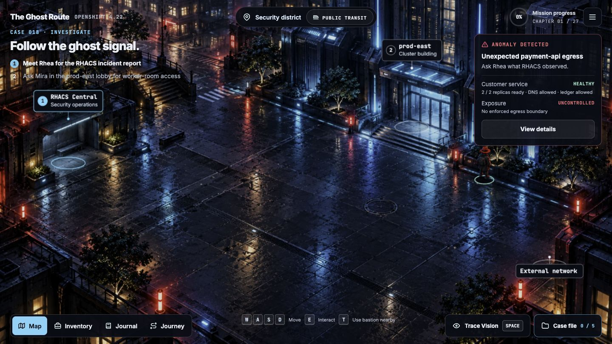

The bastion keeps the standard client help and output. Trace Vision and the
Case file sit in the bottom dock. The case drawer brings evidence, notes and
live health together; the same notebook stays beside the larger console.

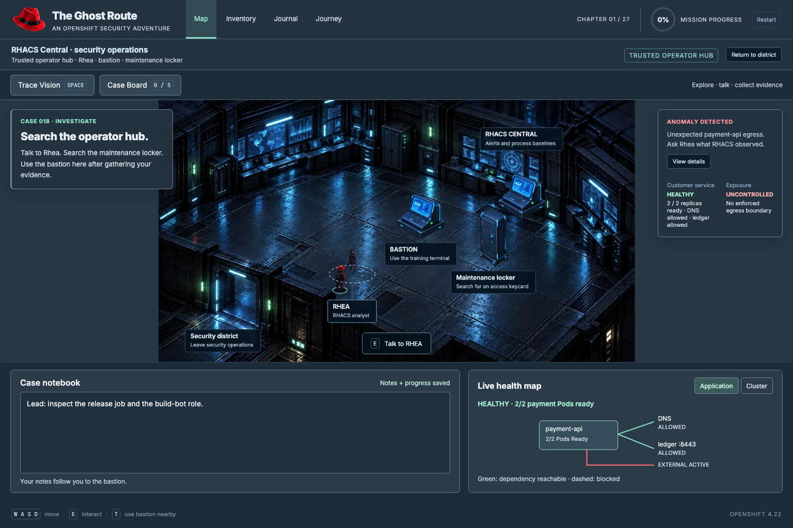

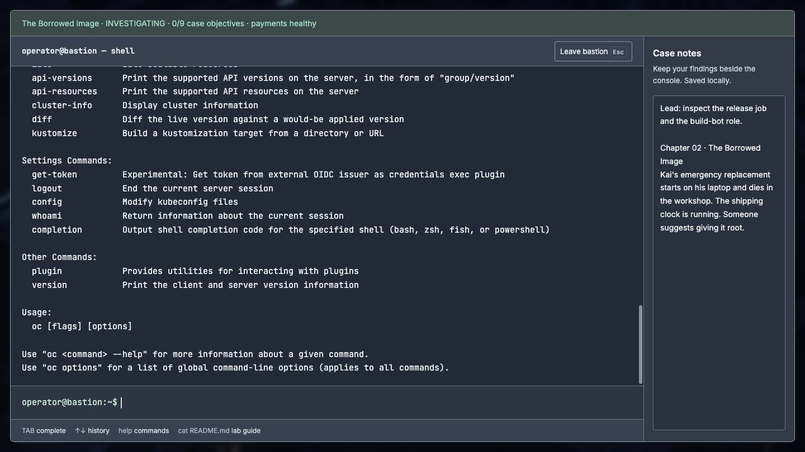

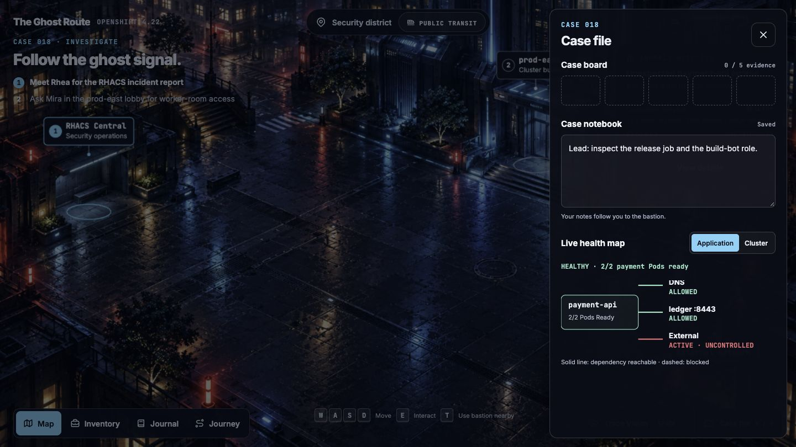

## One investigation, one changing cluster

You enter `prod-east` as an investigator. The cluster is a building you can walk
into; its worker rooms contain the applications and tenant workloads you must
understand. Mira knows the platform. Kai knows the release. Vale holds the
records. Rhea knows what the sensors observed. Their accounts give you leads;
the files and commands let you test them.

At the bastion, the first shortcut is tempting: deny every connection. The
suspicious route disappears—and checkout goes down. Mira wants to know what
you changed. You must restore the dependencies customers need while keeping
the unwanted destination blocked. A quiet alert is not enough to close the case.

The evidence leads back to a release job. It imported an unreviewed support
configuration, and build-bot had permission to patch payment-api. The log gives
you an API caller; it does not prove which person intended the change. You
preserve the timeline, remove the telemetry setting, and repair connectivity.
The immediate incident closes, but its weak links remain. Those become the next
chapters.

Kai's replacement fails under the cluster's security constraints. You inspect
its identity and filesystem instead of granting it root. A vendor workload
cannot be rebuilt so easily; its exception needs a dedicated identity, a narrow
SCC, an owner and an expiry. Meanwhile, another tenant consumes its neighbors'
resources, and a password appears in a support screenshot. Each room exposes a
different shortcut that was convenient until someone depended on it.

Then an apparently familiar image refuses to start. Its registry token leaked
and was revoked. You decode the Secret, test the rejected credential, and use
its replacement with Podman. The bastion login succeeds, but the Pods are still
waiting: their pull credentials belong to the cluster. Only after you repair
that separate path does the workload recover. Skopeo reveals the image's digest
and metadata; a familiar tag alone cannot identify the release you meant to run.

The trail expands into tenant walls, partner connections and a cable behind the
wall. Boundaries must deny the unwanted path without breaking the intended one.
You learn which rules take priority, which tool sees each event, and which
owner must maintain the repair.

At the assembly line, you meet the original failure again. A signed release can
still carry a vulnerable dependency or an unsafe manifest. You scan the image
and its SPDX SBOM with `roxctl`, inspect the findings, and compare the repaired
version. The pipeline applies the same Central policies you tested at the
bastion. The unsafe artifact stops; the repaired artifact proceeds with its
own digest. Local edits do not change that build: you must commit and push the
source. The webhook starts Tekton, and TaskRun logs show exactly where the gate
stopped. A passing build still does not promote itself. You review the Deployment
manifest, commit and push its new image, and watch Argo CD reconcile the same
payment-api in prod-east. You also close the unreviewed configuration import. The first
incident now has an explanation and controls that address its cause.

The remaining journey tests whether those controls survive change: rotating
external secrets, suspicious runtime activity, noisy alarms, misleading green
reports and untrusted workloads. In the final handover, earlier repairs are
checked again against the current cluster. Mira gets a working application.
Kai, Vale and Rhea leave with evidence and responsibilities. You leave knowing
why it works, what can still fail, and who will respond.

## The terminal is where the clues become evidence

Explore the world, collect records, take notes, then return to the bastion. The
terminal opens there. Files, resource changes, policy results and application
health all belong to the same saved simulation.

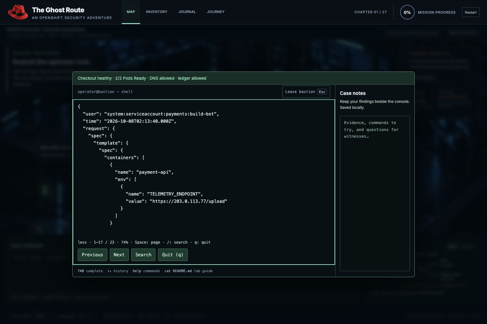

You can navigate lab files with `cd`, `ls`, `cat` and Tab completion, search logs
with `grep` and `jq`, use JSONPath or Go templates, and read long results with
`less` or `more`. An investigation can start with:

```sh
oc get pods -A
oc logs deployment/payment-api -n payments
oc get deployment/payment-api -n payments -o yaml | less
jq 'select(.verb == "patch" and .objectRef.name == "payment-api") | {user: .user.username, time: .requestReceivedTimestamp, request: .requestObject}' audit/kube-apiserver.log
```

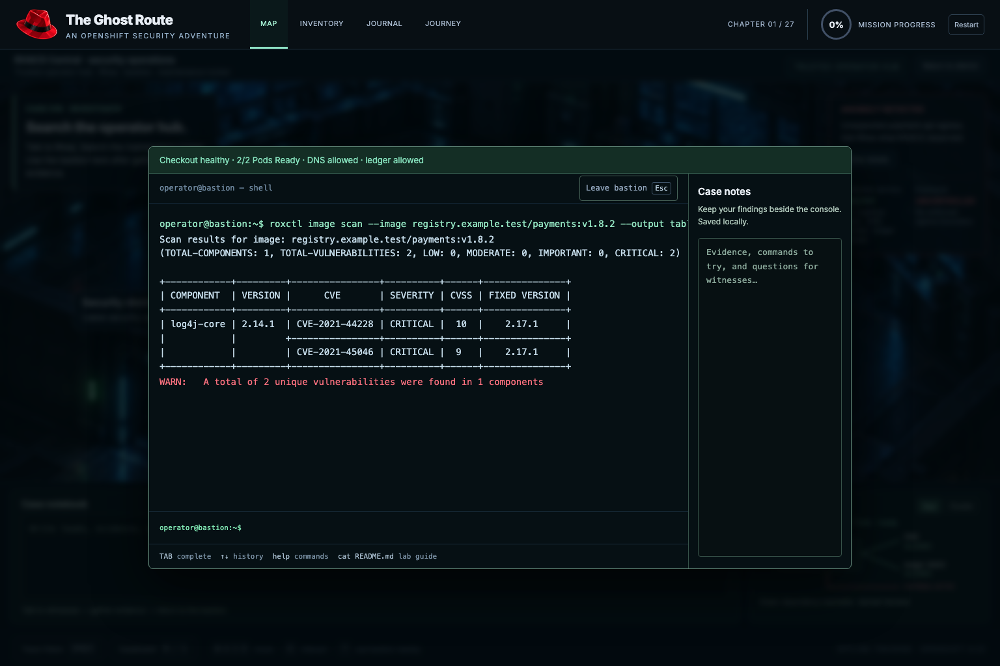

Image findings come from the game's versioned asset catalog. The vulnerable
release and its repaired replacement have different content hashes. Image and
SBOM scans use the same authored components; the release gate uses the same
policy evaluation as the interactive checks.

```sh
roxctl image scan --image registry.example.test/payments:v1.8.2 --output table
roxctl image sbom --image registry.example.test/payments:v1.8.2 > payment.spdx.json
roxctl sbom scan --file payment.spdx.json --output json --fail | jq '.result.summary'
roxctl image check --image registry.example.test/payments:v1.8.3
roxctl deployment check --file rhacs/payments-v2.yaml --output json
```

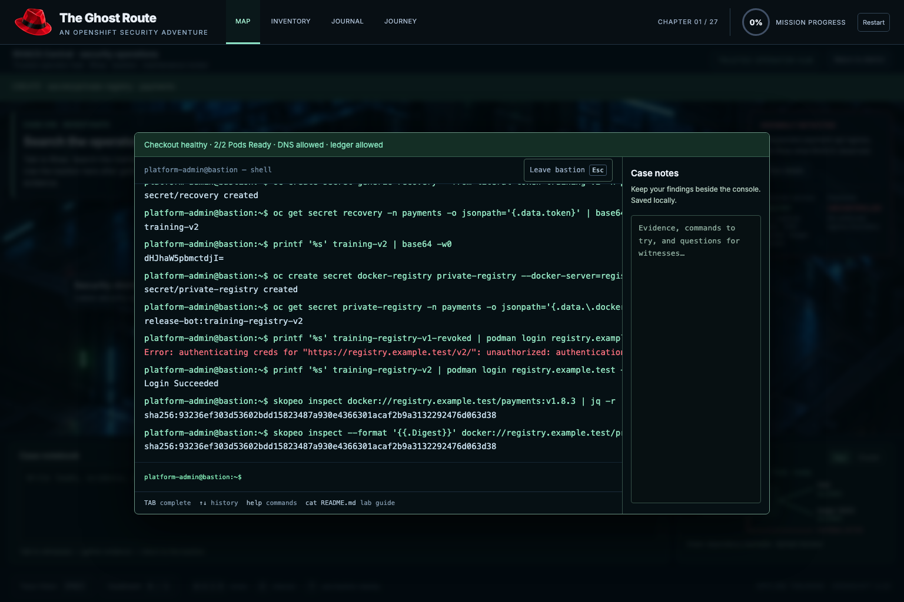

```sh
skopeo inspect docker://registry.example.test/payments:v1.8.3 | jq -r '.Digest'
skopeo inspect --config docker://registry.example.test/payments:v1.8.3
printf '%s' training-registry-v2 | podman login registry.example.test --username release-bot --password-stdin
podman pull registry.example.test/private/payments:v1.8.3
podman push registry.example.test/private/payments:v1.8.3
```

All credentials and registry addresses in the game are fictional. Kubernetes
pull Secrets retain their standard `kubernetes.io/dockerconfigjson` type and
`oc create secret docker-registry` syntax even though the bastion uses Podman.
Base64 can reveal a Secret's content; it is not encryption.

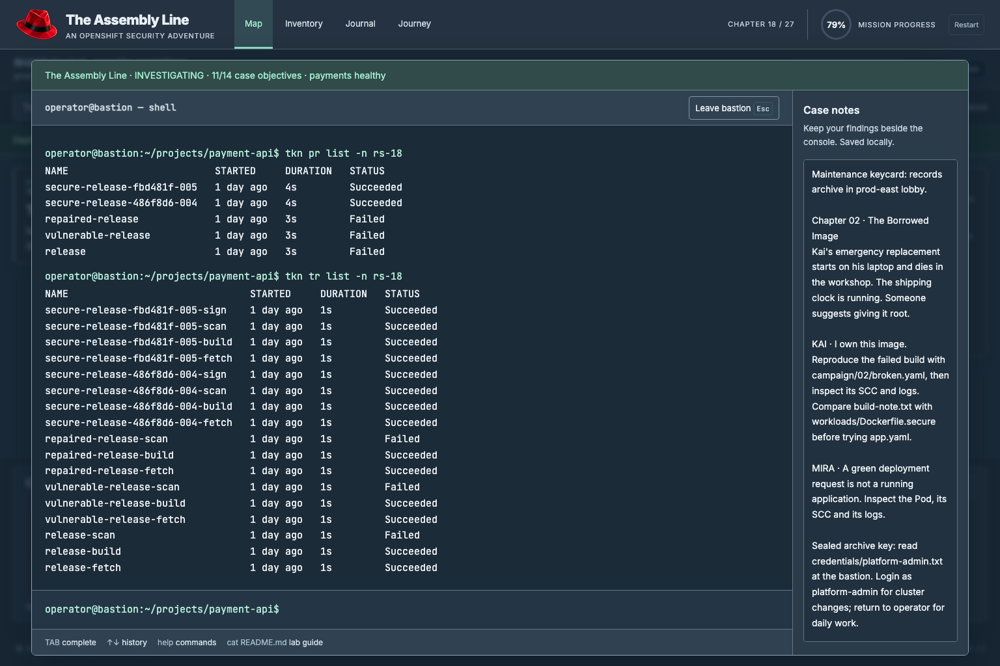

### A copied credential and a mounted credential have different lifetimes

A CSI volume maps its `secretProviderClass` to a same-namespace
SecretProviderClass. That class names the Vault role, remote path, key and
mounted filename. Read the resulting file from the Pod; verify the driver and
node registration before blaming SCC for a mount failure. The chapter requests
no Kubernetes Secret copy. The preinstalled driver also supports optional
`secretObjects` sync and two-minute rotation; inspect environment and mounted
files separately when the provider credential changes.

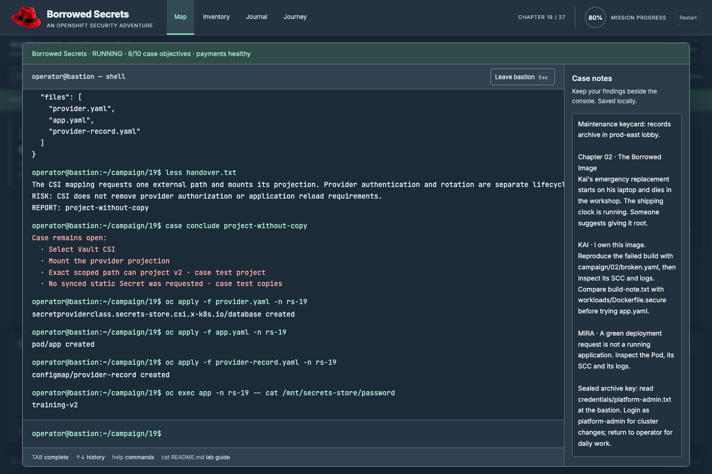

The next consumer requires a Kubernetes Secret. ESO updates that copy, and its
normal Secret-volume file follows the new value. The running container's
environment remains the value captured at startup. Inspect both before
restarting the consumer; a restart cannot repair a failed provider mapping.

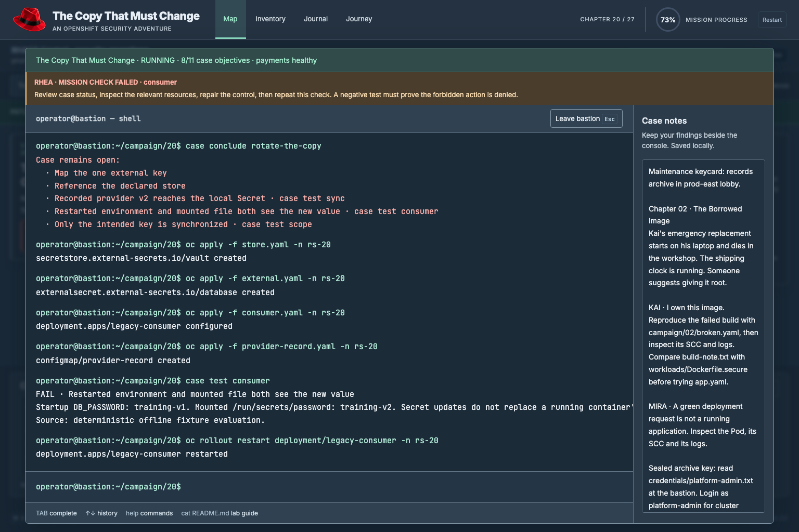

### The doors, addresses and identities are connected

Deployment metadata labels and Pod template labels are distinct. A Deployment
selector must match its template. Services select Pods by their actual labels;
Endpoints and EndpointSlices reflect their readiness and resolved target ports.
A Route can be admitted while its Service has no healthy backend. Use the
bastion to establish the whole path:

```sh
oc get deployments -n payments --show-labels
oc get deployments -n payments -L app -o wide
oc get pods -n payments -l app=payment-api --show-labels
oc get services -n payments -o wide
oc get endpointslices -n payments -l kubernetes.io/service-name=payment-api -o yaml
oc get routes -n payments -o yaml
oc exec payment-api-7d9cd-ab12 -n payments -- curl -I http://ledger:8443/health
```

`-L labels` selects the literal label key `labels`; it does not print every label.
`--show-labels` does. Use a current Pod name after a rollout.

Project provisioning uses `oc new-project`. Direct Namespace creation requires
a cluster grant. Permissions come from inspectable Roles and bindings, and
revocation takes effect immediately. A sealed envelope in the records archive
contains a separate emergency credential. Finding it gives you the opportunity
to administer the cluster; it does not make your normal operator identity an
administrator.

### The sensor remembers what the replacement Pod cannot

Authorized `oc exec` and `oc rsh` produce the enabled default exec-policy alert.
Process baselines learn names while unlocked. At the RHACS computer you can lock
a baseline and separately enable Pod termination for deviations. A Java process
launching a shell can produce its own policy violation. Runtime enforcement
removes the offending Pod; its Deployment creates a replacement. The retained
alert keeps the old Pod UID and process ancestry. Restarting does not repair
vulnerable application code.

```sh
cat rhacs/alerts.json | jq '.alerts[] | {policy: .policy.name, deployment: .deployment.name, enforcement: .enforcement}'
cat rhacs/processes.json | jq '.processes[] | {pod: .podId, uid: .podUid, process: .signal}'
cat rhacs/baselines.json | less
```

The reusable runtime engine is implemented; Chapter 20's current mandatory
case remains the bounded support-exec correlation exercise. A mandatory web
exploit-to-source-repair chapter is not yet implemented. Runtime messages and
collector signals are authored offline evidence with upstream protobuf field
shapes, not a live Collector capture.

Your [auditing demo](https://github.com/ralvares/security-demos/tree/6954a942a4d1a19b172f510e10e5838fa7ede6ad/use_cases/auditing)
contributes a separate historical reference archive and a TypeScript adaptation
of its custom timemachine plugin. It does not execute Python or Bash. The 40
selected original events preserve their timestamps, identities and source IPs;
they are not presented as events from prod-east.

```sh
cat forensics/README.md
oc timemachine --auditlog-file ~/forensics/reference-audit.log get deployments -n frontend --time 2025-12-10T06:31:00Z -o json
oc timemachine --auditlog-file ~/forensics/reference-audit.log get pods -n frontend -o wide
oc timemachine --auditlog-file ~/forensics/reference-audit.log get services -n frontend -o wide
cat forensics/reference-audit.log | jq 'select(.user.username == "system:serviceaccount:payments:visa-processor") | {time: .requestReceivedTimestamp, sourceIPs, verb, objectRef}'
```

Real installations need the custom plugin installed. Current port scope:
retained-object snapshots, explicit time zones, successful writes, direct
object history, selectors and JSON/YAML/table output. Recursive ownership
lineage and full upstream history formatting remain outside this adapter.
Wide output uses the same resource tables as `oc get`: Deployments show their
containers, images and selectors; Pod IPs and Service ClusterIPs belong to
their respective resource tables. Pod addresses retained in OVN annotations
are recovered for the historical table without rewriting the source records.

You can fix the opening incident before collecting every clue. Rhea's five
original observations remain in **Case file** and `~/case/incident-018/` at the
bastion. Reviewing a retained record collects evidence without reapplying the
old configuration or removing your policies. The board distinguishes current
remediation from evidence review, and the debrief lets you return to the case
without restarting. Notes now include copyable commands from collected leads;
your handwritten notes stay intact and both survive local save/resume.

## The 27 stages

Each stage carries the investigation forward. Interviews, dossiers and terminal
evidence lead to a repair; positive and negative checks prove that the required
behavior works and the unsafe path is closed. Earlier resources and notes stay
in `prod-east` throughout the journey.

| Stage | Challenge in the story | What you learn |
| --- | --- | --- |
| 01 · The Ghost Route | Explain the telemetry change and contain it without taking checkout down. | Logs, Deployment configuration, audit evidence and dependency-aware NetworkPolicy. |
| 02 · The Borrowed Image | Kai's replacement cannot write its data directory under the assigned identity. | Arbitrary UIDs, filesystem permissions and fixing an owned application. |
| 03 · The Door That Opens Twice | The release identity can do more than its handover requires. | Scoped RBAC, service accounts and proving a forbidden action is denied. |
| 04 · Permission Denied | A workload asks for authority it should not need. | Restricted SCC admission and the difference between admission and runtime startup. |
| 05 · The Vendor's Locked Box | Third-party software needs an identity you cannot change. | A dedicated service account, narrow custom SCC and accountable exceptions. |
| 06 · The Hungry Tenant | One tenant exhausts shared resources. | LimitRange defaults and aggregate ResourceQuota. |
| 07 · The Password in the Window | A leaked password remains in a running consumer. | Credential retirement, Secret references and restart versus projection updates. |
| 08 · The Glass Front Door | Customers send credentials through an insecure public entrance. | Route TLS, HTTP redirects and where edge encryption ends. |
| 09 · The Familiar Tag | A revoked registry credential blocks a release whose tag looks trustworthy. | Base64 inspection, Podman authentication, pull Secrets, Skopeo and digest pinning. |
| 10 · The Missing Minute | The incident timeline has gaps and an easily blamed API identity. | Correlating caller, request, response and time without inventing attribution. |
| 11 · Draw the City Before the Fire | The team has tools but no agreed map of what matters. | Assets, trust boundaries, abuse paths and control owners. |
| 12 · Three Watchtowers | Different tools report different parts of the same problem. | RHACS, Compliance Operator and Security Profiles Operator responsibilities. |
| 13 · Neighbors Through the Wall | An unrelated tenant can reach a protected workload. | Ingress and egress isolation that preserves the legitimate client. |
| 14 · The Rule Above the Rules | A tenant allow rule conflicts with a corporate boundary. | AdminNetworkPolicy priority, Deny/Allow/Pass and baseline policy. |
| 15 · A Name on the Outside | A partner needs a stable identity for outbound requests. | EgressIP selection and its separation from destination permission. |
| 16 · Two Cities, One Address Book | Tenants need separate network domains. | Primary user-defined networks and domain-specific addressing. |
| 17 · The Cable Behind the Wall | A secondary attachment creates another possible path. | NetworkAttachmentDefinition, worker capabilities and attachment boundaries. |
| 18 · The Assembly Line | An unsafe release can be signed and shipped again. | Image/SPDX scans, CVEs, deployment checks, Central policy gates and digest binding. |
| 19 · Borrowed Secrets | An application needs a scoped external secret projection. | Same-namespace SecretProviderClass mapping, driver registration, provider authorization and reading the mounted file. |
| 20 · The Copy That Must Change | An external credential rotates while a running consumer retains its startup value. | ESO refresh policy and ownership; mounted file updates versus startup environment; consumer restart after rotation. |
| 21 · One Event Is Not a Story | A runtime event could be support work or suspicious behavior. | Context from Pod, namespace, caller, time and runtime evidence. |
| 22 · The Alarm That Cried Fire | Normal bursts drown out sustained abnormal activity. | Duration-aware detection thresholds and useful correlation. |
| 23 · The Green Report | A green result hides an unresolved applicable failure. | Remediation, justified tailoring and honest compliance evidence. |
| 24 · A Room Inside a Room | An untrusted workload needs a stronger execution boundary. | Kata VM isolation; RuntimeClass admission, node eligibility, installed runtime handler and independent SCC admission. |
| 25 · The Smallest Set of Moves | A workload has more syscall access than its normal behavior needs. | Workload-specific seccomp profiles and recording versus enforcement. |
| 26 · The Front-Door Covenant | New workloads can bypass the team's ownership standards. | Scoped admission constraints and bounded exceptions. |
| 27 · The City That Remembers | The team must operate safely after the investigator leaves. | Rechecking earlier controls, evidence handover, ownership and exception expiry. |

Each learning claim has an observable acceptance contract in [LEARNING_CONTRACTS.md](docs/LEARNING_CONTRACTS.md), including component versions, commands, negative checks and current engine boundaries.

Concepts are adapted from the [OpenShift security framework](https://github.com/ralvares/openshift-security-framework).
[CAMPAIGN.md](CAMPAIGN.md) maps stages to its source labs;
[STORYLINE.md](STORYLINE.md) records the incident threads and their resolution.

## What the offline world simulates

The game runs as static HTML, JavaScript, CSS, artwork and local WASM tools.
Progress, notes, resource changes and files save in your browser. After the
initial asset cache finishes, the journey works offline. There is no cluster
connection or backend.

The simulation targets OpenShift 4.22 concepts and selected command/API behavior.
RHACS output is based on pinned `roxctl` 4.11.3 sources and native comparisons.
Authored image hashes are actual SHA-256 hashes of their content records, not
real OCI image manifests. Vulnerability results are deterministic training
fixtures. Container builds, actual container execution, cryptographic signing
and arbitrary external image scans are outside this implementation. Unsupported
commands fail explicitly. The proposed attacker-persona exploitation path is
not yet playable.

[CLUSTER_GUIDE.md](CLUSTER_GUIDE.md) documents command coverage and limits;
[API_CONFORMANCE.md](API_CONFORMANCE.md) records compatibility checks;
[ARCHITECTURE.md](ARCHITECTURE.md) describes shared state and module ownership.
The preserved original game is `legacy/nexus_ghost_route_game.html`.

## Playing and running locally

Move with WASD/arrows or click the world. Press E to interact. Space toggles
Trace Vision near a workload. Walk to the bastion at RHACS Central and interact
with E or nearby T to open the terminal. Notes travel with you. Use the Journey
menu to review stages, and `case status` or `case hint` at the bastion for leads.
Close the opening case and choose **Continue journey** at its debrief.

Every chapter has a direct case question in **Case file**, with the exact
record and field to inspect. Chapter 01 asks for the service account, release
run and imported filename. Later cases ask for a concrete value such as an
SCC name, quota, source IP or signing prerequisite. Use **Show hint** and,
if needed, **Show answer**; incorrect answers can be retried without losing
progress. Submit your answer after the displayed fixes and verification pass.
The terminal conclusion commands remain available as an alternative.

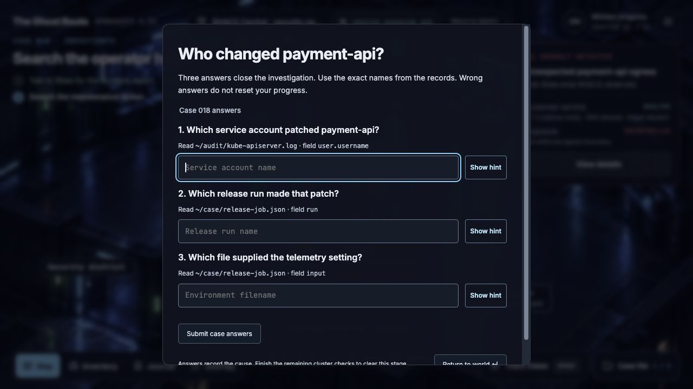

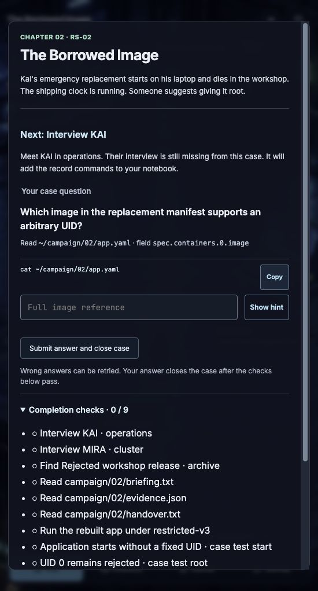

[CASE_QUESTIONS.md](docs/CASE_QUESTIONS.md) lists the question and evidence source
for every chapter. Character advice and `case hint` follow the actual remaining
step; completed configuration and network fixes are acknowledged. Radio advice
includes copyable commands, and witness notes retain their next action.

Type `help` for commands. Read the current `campaign/XX/briefing.txt`, meet its
witnesses, find its dossier, and complete the displayed checks before submitting
the case answer or using `case conclude`.
Changes invalidate older checks, so verify the final state. Resources, reports
and notes carry into the next stage.

Requires Node.js 22.12 or later and npm:

```sh
npm ci
npm run dev
```

Open http://127.0.0.1:5173. Development mode does not install the offline cache.
For a production build and offline play:

```sh
npm test
npm run build
npm run preview -- --port 4174
```

Open http://127.0.0.1:4174. Check `game status` before disconnecting. Progress
saves automatically; reload resumes it. `game export` downloads a portable JSON
backup and `game import` restores one. Saves belong to the browser and origin;
a different port or browser needs export/import. Restart clears current progress.
Serve through HTTPS or localhost; `file://` does not install the offline cache.

Browser checks require Python Playwright and Chromium:

```sh
python3 -m pip install -r tests/requirements.txt
python3 -m playwright install chromium
npm run test:browser
npm run test:semantics
npm run test:cluster
npm run test:offline
npm run test:rpg
python3 tests/campaign_browser.py http://127.0.0.1:4174/
python3 tests/rhacs_browser.py http://127.0.0.1:4174/
```

## Publishing to GitHub Pages

GitHub Pages serves the complete `dist` directory. The included workflow tests,
builds and publishes on a push to master/main, with Pages configured to use
GitHub Actions. For this repository's project path:

```sh
npm ci
npm test
npm run build -- --base=/ghostroute/
```

The published game is [ralvares.github.io/ghostroute](https://gameplay.ralvares.com/).
Use `/` for a user site or custom domain. Cached updates activate when the
complete new build is available; reload to use it. Local progress is retained.
